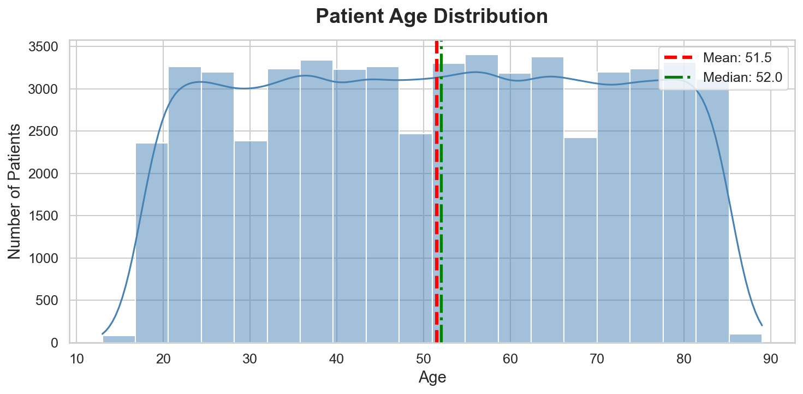
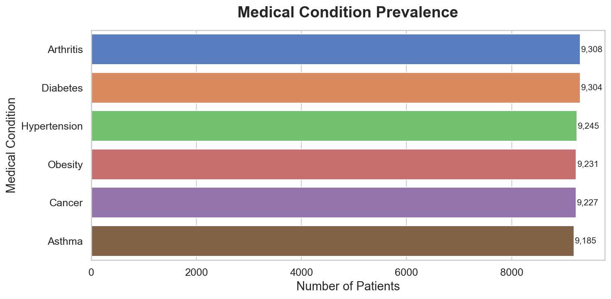
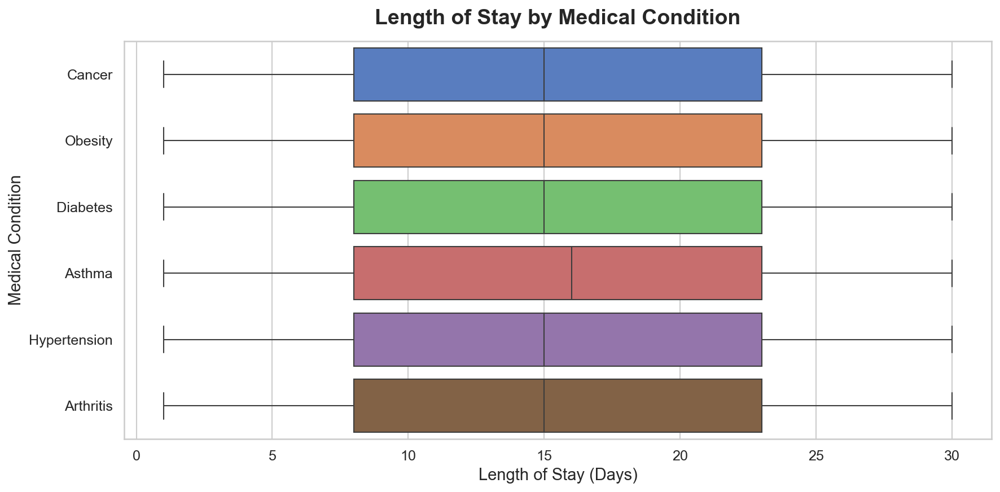
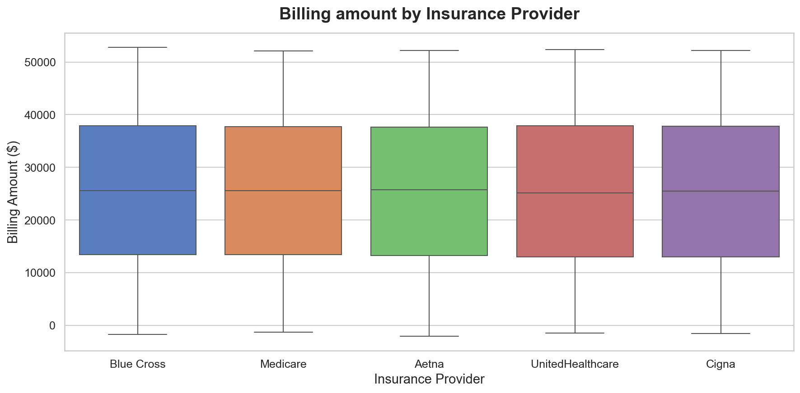
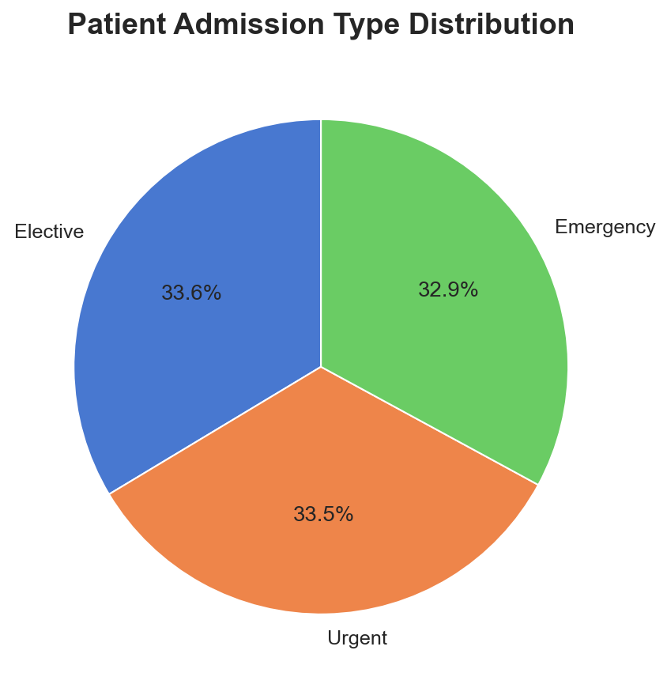
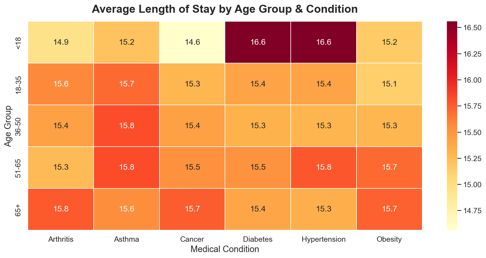

# 🏥 MediStat — Hospital Patient Analytics Project


## 📌 Project Overview

A comprehensive exploratory data analysis of a multi-hospital patient
records dataset. This project describes the work of a healthcare data
analyst — uncovering patterns in admissions, billing, medical conditions,
and length of stay to support data-driven operational decisions.

---

## 🎯 Business Questions

1. What is the distribution of patient age across the hospital network?
2. Which medical conditions are most prevalent — and how do they vary by demographic?
3. What factors drive longer hospital stays?
4. Are there billing patterns or anomalies tied to insurance providers?
5. How does age group correlate with condition severity and length of stay?

---

## 📂 Project Structure
```
medistat-patient-analytics/
│
├── data/
│   ├── raw/                  # Original Dataset
│   └── processed/            # Cleaned and processed dataset
│
├── notebooks/
│   └── 01_eda.ipynb          # Main analysis notebook
│
├── outputs/
│   ├── figures/              # Visualizations
│   └── reports/              # Summary outputs
│
├── requirements.txt
└── README.md
```

---

## 📊 Key Findings

| Finding | Insight |
|---|---|
| Age Distribution | Symmetric distribution centered around 51–52 years. No significant outliers. |
| Condition Prevalence | All 6 conditions evenly distributed — suggests standardized patient intake. |
| Length of Stay | Asthma patients show longest average stays due to recurring episode cycles. |
| Billing Patterns | Billing is provider-agnostic — consistent across all insurance companies. |
| Admission Type | Emergency admissions drive longest stays across all conditions. |
| Age & Severity | 65+ patients show highest length of stay — driven by clinical complexity. |

---

## 📈 Visualizations

### Age Distribution


### Medical Condition Prevalence


### Length of Stay by Condition


### Billing by Insurance Provider


### Admission Type Breakdown


### Age Group vs Condition Heatmap


---

## ⚙️ Setup & Usage

### 1. Clone the Repository
```bash
git clone https://github.com/proshanta-pal/Medistat-Hospital-Patient-Analytics.git
cd medistat-patient-analytics
```

### 2. Install Dependencies
```bash
pip install -r requirements.txt
```

### 3. Download the Dataset
Download from [Kaggle — Healthcare Dataset](https://www.kaggle.com/datasets/prasad22/healthcare-dataset)
and place it in `data/raw/healthcare_dataset.csv`

### 4. Run the Notebook
```bash
jupyter notebook notebooks/01_eda.ipynb
```

---

## 🛠️ Tech Stack

| Tool | Purpose |
|---|---|
| Python 3.10+ | Core language |
| Pandas | Data manipulation & Processing |
| NumPy | Statistical computations |
| Matplotlib | Visualization |
| Seaborn | Statistical visualizations |
| Jupyter | Interactive analysis environment |

---

## 💡 Future Work

- Build a patient risk scoring model using length of stay as target variable
- Integrate anomaly detection for billing fraud identification
- Create an interactive dashboard using Plotly or Streamlit

---

## 👤 Author

**Proshanta Pal**

[LinkedIn](https://www.linkedin.com/in/proshanta-pal)
[GitHub](https://github.com/proshanta-pal)
